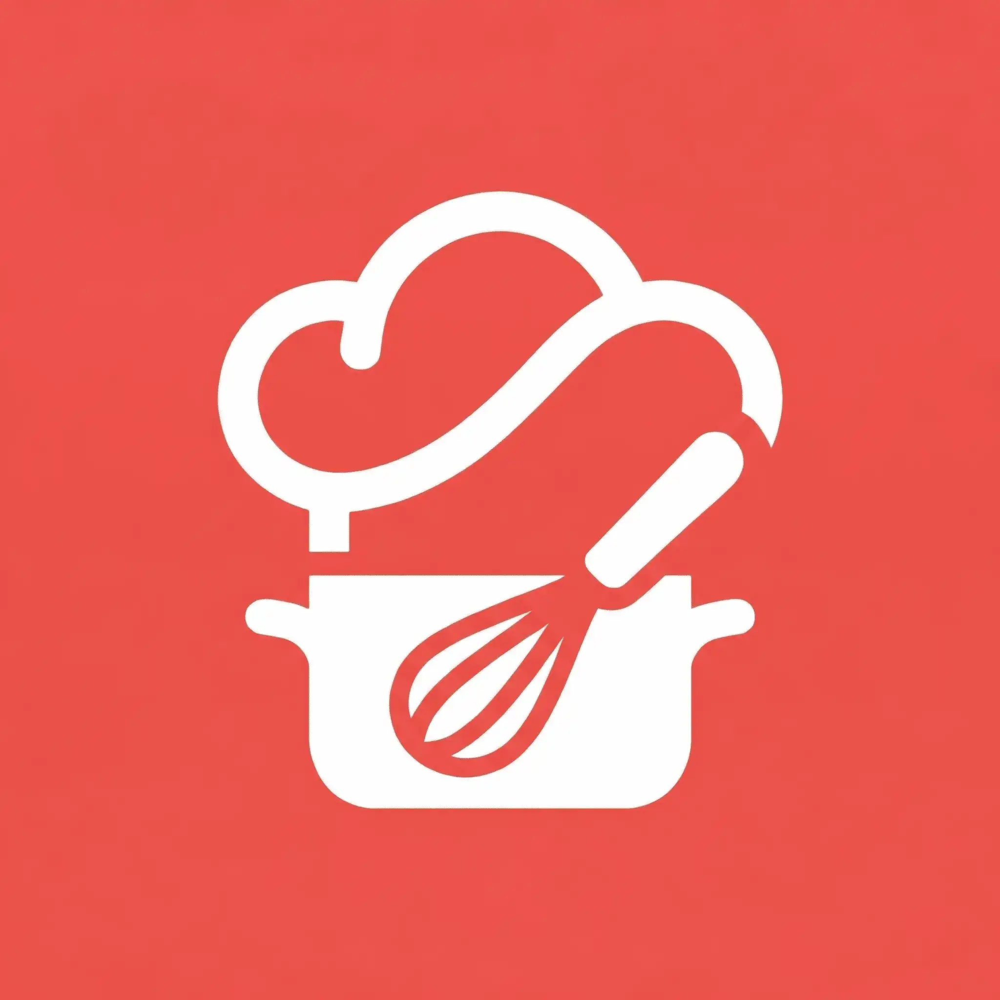
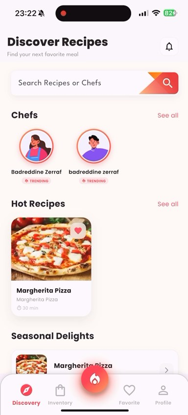
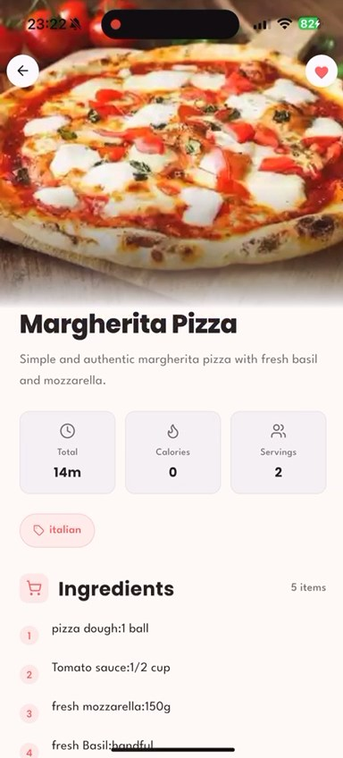
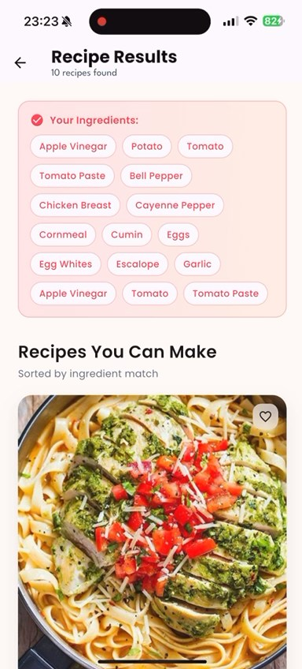
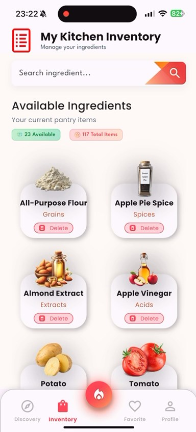
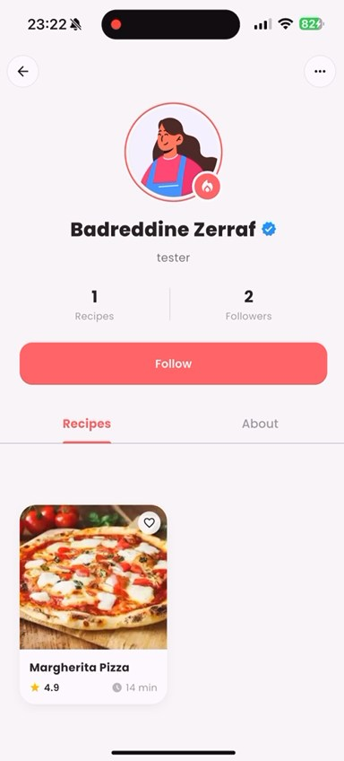
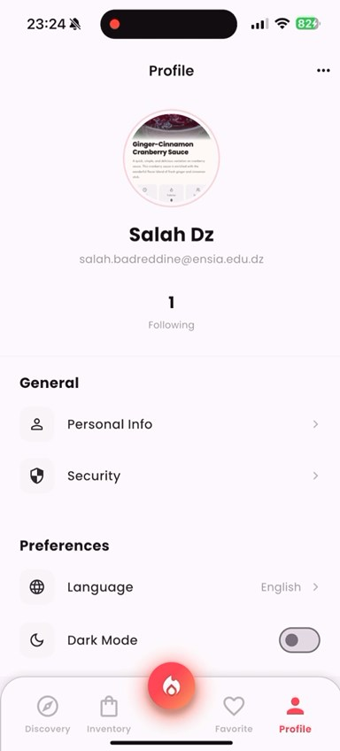
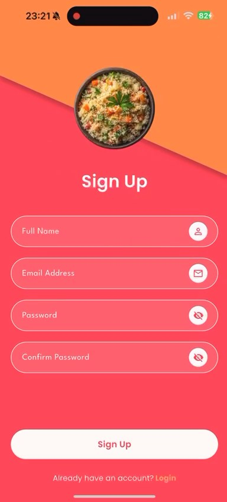
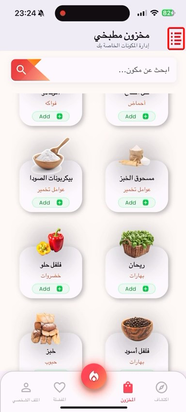

<h1 style="font-family: Arial, sans-serif; font-size: 34px; color: #ed534c; display: flex; align-items: center; gap: 12px; border-bottom: 3px solid #ed534c; padding-bottom: 8px;">
  
    ChefKit - Your Cooking Companion
</h1>

ChefKit is a modern, multilingual cooking app built with Flutter and Flask.
It combines recipe discovery, chef profiles, inventory management, favorites, and push notifications in one mobile experience.

---

## Global Objective

ChefKit is designed to help users discover recipes, manage ingredients, and engage with chefs through a responsive and localized experience.

Core outcomes:
- Personalized recipe discovery and recommendations
- Reliable favorites and chef follow workflows
- Ingredient-based inventory support
- Multilingual UX (English, Arabic, French)
- Push notifications for daily cooking engagement

---

## Tech Used


Frontend:
- Flutter
- flutter_bloc
- http
- sqflite
- firebase_messaging
- flutter_dotenv

Backend:
- Flask
- Supabase (database + auth)
- Firebase Admin SDK
- APScheduler
- Cloudinary

---

## Key Features

| Home | Recipe Discovery | Search |
|---|---|---|
|  |  |  |

| Inventory | Chef Profiles | Profile |
|---|---|---|
|  |  |  |

| Sign In | OTP | Arabic |
|---|---|---|
|  |  |  |

- Recipe discovery with trending and seasonal content
- Smart search and recommendations
- Ingredient inventory tracking
- Chef profiles with follow support
- Authentication flow with OTP
- Multilingual support (English, Arabic RTL, French)

---

## Core Functionality Status

### Recipe Favorites (Fixed)
Users can:
- Save recipes via heart action
- View all favorites in dedicated page
- Sync favorites with backend
- Benefit from optimistic UI updates

Technical notes:
- Supabase `users.user_favourite_recipees` array
- Local cache for offline access
- Retry + error recovery handling

### Chef Follow (Fixed)
Users can:
- Follow/unfollow chefs
- See follower counts update in real-time
- Sync changes with backend
- Get optimistic UI feedback

Technical notes:
- Supabase `follows` table
- Trigger-based follower count updates
- Proper auth checks and resilient rollback behavior

---

## Quick Start

Prerequisites:
- Flutter 3.x+
- Python 3.8+
- Node.js (Firebase tooling)
- Supabase account
- Firebase account

Local development:
```bash
# backend
./start_backend.sh

# app
./start_app_local.sh
```

Production app run:
```bash
./start_app_prod.sh
```

---

## Manual Setup

Backend:
```bash
cd backend
python3 -m venv venv
source venv/bin/activate
pip install -r requirements.txt
```

`backend/.env`:
```env
SUPABASE_URL=your_supabase_url
SUPABASE_ANON_KEY=your_anon_key
SUPABASE_SERVICE_KEY=your_service_key
```

Start backend:
```bash
python app.py
```

Flutter app:
```bash
flutter pub get
```

Project root `.env`:
```env
BASE_URL=http://localhost:8000
SUPABASE_URL=your_supabase_url
SUPABASE_ANON_KEY=your_anon_key
```

Run app:
```bash
flutter run --dart-define=BASE_URL=http://localhost:8000
```

---

## Project Structure

```text
chefkit/
|- lib/
|  |- blocs/              # State management (BLoC)
|  |- domain/             # Models and repositories
|  |- views/              # UI screens and widgets
|  |- common/             # Shared utilities
|  |- l10n/               # Localization files
|- backend/
|  |- app.py              # Flask application
|  |- services.py         # Business logic
|  |- auth.py             # Authentication middleware
|  |- requirements.txt    # Python dependencies
|- assets/
|  |- images/             # App images
|  |- fonts/              # Custom fonts
|- test/                  # Unit and widget tests
```

---

## Testing

```bash
flutter test
flutter test integration_test/
flutter test test/authentication/auth_cubit_test.dart
```

---

## Troubleshooting

Backend not running:
```bash
lsof -ti:8000
lsof -ti:8000 | xargs kill -9
./start_backend.sh
```

Flutter build errors:
```bash
flutter clean
flutter pub get
flutter run
```

Favorites not saving:
1. Verify backend health: `curl http://localhost:8000/health`
2. Ensure user is authenticated (not guest)
3. Check backend logs
4. Confirm `BASE_URL` in `.env`

Chef follow issues:
1. Confirm backend is running
2. Verify authentication token
3. Review Supabase/backend logs

---

## Recent Fixes

### January 10, 2026
- Fixed recipe favorites persistence
- Fixed chef follow functionality
- Improved retry and error handling
- Added optimistic UI updates
- Fixed favorites list refresh behavior
- Added localization coverage for favorites
- Added startup scripts for faster setup

Details: [FIXES_APPLIED.md](FIXES_APPLIED.md)

---

## Known Issues

1. Recipe translations require DB availability (fallback to English)
2. Local cache can desync across devices (pull-to-refresh resolves)
3. Network is still required for follow/favorite operations

---

## Future Enhancements

- Offline queue for favorites sync
- Sync status indicator
- Pagination for large favorites
- Undo action for unfavorite
- Local caching of follow state
- Animated heart interaction
- Rich notifications for likes/follows
- Recipe social sharing
- Voice-guided cooking
- Meal planning calendar

---

## License

This project is proprietary software. All rights reserved.

## Contributors

- Development Team - ChefKit

## Support

For issues or questions, contact the development team.
